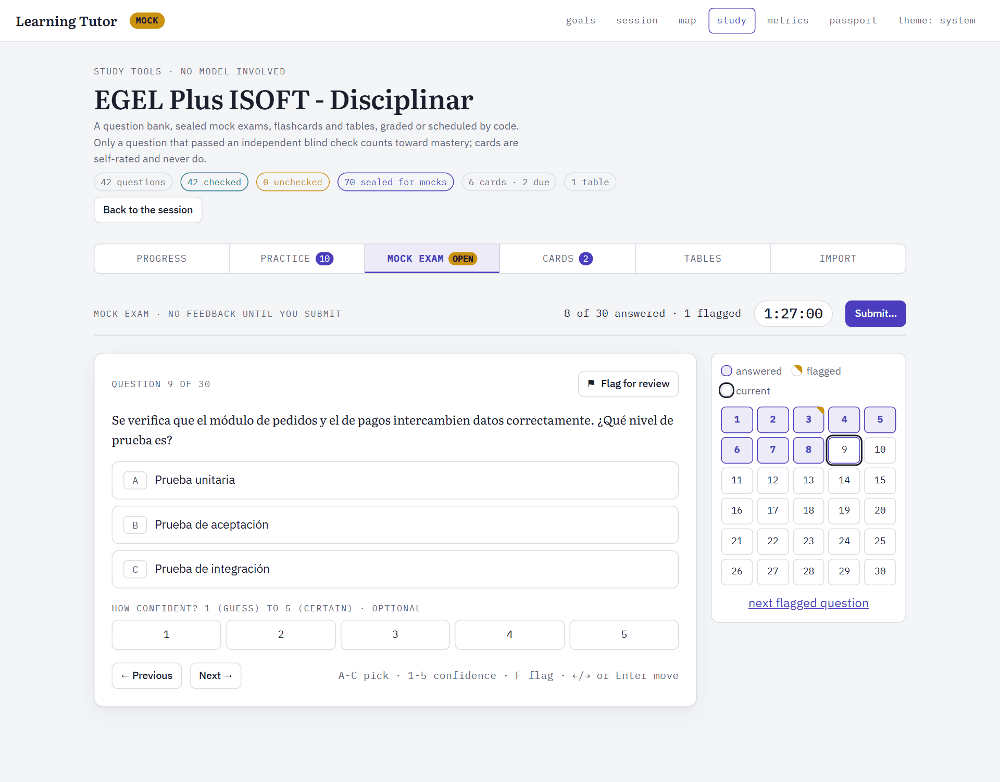
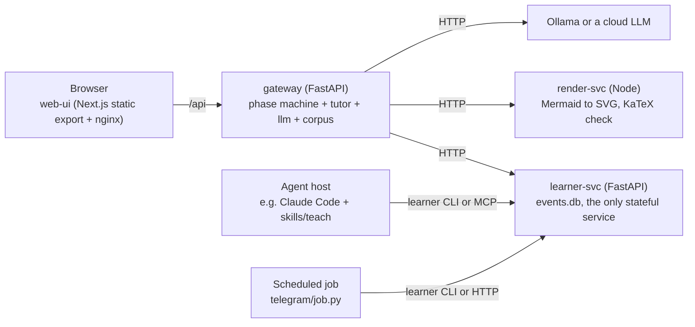

# Learning Tutor

A one-to-one AI tutor that probes what you can already do, plans a dependency graph from there to your goal, and teaches one step at a time, on top of a learner model the language model is never allowed to edit.

Learning Tutor is a personal study tool for one learner working toward a technical goal: a course, a paper, or a fixed-date exam. It runs a probe → plan → teach loop with graded checkpoints, a hint ladder, teach-back and misconception tracking. Every fact about the learner is an event in an append-only SQLite store, and the state the tutor reads is recomputed from those events by code. It runs two ways: in the browser, where a FastAPI gateway drives a local model through Ollama (or a cloud provider), or inside an agent host such as Claude Code, which loads the bundled `teach` skill and talks to the same learner model through a CLI or an MCP server. An exam-prep module (question bank, mixed practice, sealed mock exams, progress by area) is currently set up for the EGEL Plus ISOFT software-engineering exam.


**Status, stated plainly.** The code for all three stages is built and tested, but the stages have pedagogical gates (does it measurably teach, on hidden delayed-transfer items) that only a real learner over real weeks can pass, and none has been passed yet. There is no hosted demo: the browser UI needs the gateway and a model. `npm run dev:mock` in `web-ui/` runs the UI against an in-browser fake gateway; the screenshots come from a production build of that mock (`npm run build:mock`).

## Contents

- [Features](#features)
- [Engineering highlights](#engineering-highlights)
- [Tech stack and design decisions](#tech-stack-and-design-decisions)
- [Getting started](#getting-started)
- [Configuration](#configuration)
- [Tests, lint and CI](#tests-lint-and-ci)
- [Security and limitations](#security-and-limitations)
- [Documentation](#documentation)
- [License](#license)
- [Author](#author)

## Features

- **Probe, plan, teach.** A goal contract (concept, Bloom depth, purpose, deadline, minutes per session) starts a phase machine: optional grounding in your own material, a planned prerequisite graph with a feasibility check against the deadline, a probe that looks for the edge of what you know, then one teaching step at a time with a checkpoint after each.
- **No answer before an attempt.** Hints climb a ladder from encouragement (level 1) to a worked solution (level 6). The reveal is only allowed after an attempt, and the assistance level is stored with every answer, so a pass at level 5 never counts as a pass at level 0.
- **Evidence, not a mastery percentage.** A concept is `known` only after passed checks on validated items; self-report opens a dispute instead. `learner.md`, the summary the tutor reads at session start, shows evidence counts, dates and uncertainty, never decimals.
- **Generated questions earn their way into evidence.** Every item starts `TEACHING_ONLY`. It becomes `PRACTICE_EVIDENCE` only after a blind solve by a different model (or a person) agrees with its key, and a slice of trusted items is held out, never taught, to measure delayed retention honestly.
- **Misconceptions are hypotheses.** A confident wrong answer opens a `suspected` misconception; reasoning, a reworded prediction and a counterexample confirm or drop it (`suspected → active → weakened → resolved → recurred`).
- **Spaced review with FSRS** scheduled on individual items, not on whole concepts.
- **Grounding with citations.** Upload PDF, DOCX, PPTX or Markdown; the corpus is searched with SQLite FTS5 plus embeddings, the plan cites a page or slide for each concept or visibly abstains, and source text is treated as data, never as instructions.
- **Study tools with no model in the loop.** Import a question bank from Markdown, practise with server-side grading, flip flashcards (self-rated, never evidence) and drill comparison tables.
- **Exam prep.** The exam's official blueprint stored as data, new questions interleaved by exam weight, options shuffled per question and day, sealed mock exams with a timer and a navigator, and first-try accuracy by area with Wilson score ranges.
- **Your own map.** A curriculum map and a learner path drawn as two graphs, evidence receipts behind every colour, and a "learner passport" export of goals, evidence, misconceptions and disputes.
- **An MCP server with 45 tools** over the learner model, in-process or proxied to the HTTP service, so any MCP client can run sessions against the same store.
- **Optional Telegram reminders.** A scheduled job pushes one due review question with tap buttons and records the tap as an answer. It pushes retrieval, never content, and sends nothing when nothing is due.


## Engineering highlights

1. **Code decides, the model generates.** One orchestration module owns the decisions (when the probe stops, pass or fail, which hint levels are legal, when to switch teaching strategy, the misconception sequence, plan feasibility, item promotion), and the model only writes text and questions. The browser mode loads its prompts from the same `skills/teach` prompt pack the agent-host mode uses, so the pedagogy has one source of truth. See [`learning_tutor/tutor/orchestrator.py`](learning_tutor/tutor/orchestrator.py), [`generate.py`](learning_tutor/tutor/generate.py) and [`skills/teach/`](skills/teach/).
2. **An append-only event store with derived state.** Events are never updated or deleted; state, FSRS schedules and the `learner.md` view are folds over the log. Writes carry idempotency keys, so a retried request replays the stored response instead of writing a duplicate answer, and the schema is at version 4, reached by forward-only migrations. Concepts have stable ids and aliases, so evidence survives graph revisions. See [`learning_tutor/learner/`](learning_tutor/learner/).
3. **Measurement validity is enforced in code.** The solver role must resolve to a different provider and model from the tutor, or blind checks refuse to run. Every answer records how it was graded, and a model grading its own learner (`host_llm`) is stored but never counts toward mastery. Holdout items are never served for teaching or review. See [`learning_tutor/llm/config.py`](learning_tutor/llm/config.py) and [`learning_tutor/learner/evidence.py`](learning_tutor/learner/evidence.py).
4. **Answer keys stay on the server.** The gateway keeps the keys of the items it authored and grades against them; the browser never receives a key before an attempt, and shuffled options are graded against the order in which they were shown. See [`learning_tutor/gateway/`](learning_tutor/gateway/).
5. **Hybrid search with cite-or-abstain.** Corpus search fuses FTS5 `bm25` candidates and cosine similarity over stored embeddings with reciprocal rank fusion, and a sanitizer flags text in uploaded sources that addresses the model with instructions. See [`learning_tutor/corpus/`](learning_tutor/corpus/).
6. **Tested without a model.** The gateway tests run the whole stack in one process by mounting the learner service through `httpx.ASGITransport`, every LLM call is faked, and a scripted simulated learner ([`scripts/sim_learner.py`](scripts/sim_learner.py)) exercises the gates that can be automated, such as a shorter probe in session 2 and the false-mastery rate on holdouts.



## Tech stack and design decisions



- **Python 3.11 with uv** for the learner core, its HTTP service, the gateway and the MCP server (FastAPI, FastMCP, Pydantic, Typer, py-fsrs 6). The `learner` CLI core *is* the service's core; nothing was rewritten between stages.
- **Four containers, not six.** A module becomes its own container only when it needs a different runtime, a different security boundary, independent scaling or a second consumer. So the gateway, LLM layer, tutor and corpus share one Python process, `learner-svc` is separate because it owns the database, `render-svc` is separate because it is Node, and the web UI is a static export behind nginx that proxies `/api`.
- **SQLite for both stores.** `events.db` holds the append-only log; `corpus.db` holds chunks, an FTS5 index and embeddings. For one learner with hundreds of documents, a vector database would be an extra service with no benefit.
- **Rule-based evidence first, FSRS on items only.** Concept state comes from transparent rules over independent, assisted, delayed and transfer evidence. FSRS is calibrated on atomic recall items, so it schedules items, not concepts.
- **Provider-agnostic LLM layer.** Six providers sit behind one interface (Ollama, LM Studio, OpenAI, Anthropic Claude, Google, a custom endpoint). The defaults are `llama3.1:8b` as the tutor and `gemma3:12b` as the blind solver, both local through Ollama.
- **Mermaid rendering in Node.** `render-svc` turns Mermaid into SVG with `beautiful-mermaid`, checks Mermaid syntax and validates LaTeX with KaTeX, so the model's diagrams are checked before a learner sees them.

```text
learning_tutor/
  learner/        the core: event store, graph, items, evidence rules, FSRS, misconceptions,
                  disputes, holdouts, study tools, exam prep, views
  learner_svc/    the core over HTTP (:5034)
  gateway/        the browser API (:5033): phase machine and routes
  tutor/          orchestrator.py decides, generate.py generates, prompts.py loads the pack
  llm/            providers, structured generation with retries, the tutor/solver split
  corpus/         ingest, hybrid search, citations, source roles, sanitizer
  mcp_server.py   45 MCP tools over the learner core
  cli.py          the `learner` CLI
skills/teach/     the teaching procedure (SKILL.md) and the versioned prompt pack
telegram/         optional reminder job (tick and poll)
render-svc/       Node service: Mermaid → SVG, Mermaid and KaTeX checks
web-ui/           Next.js 15 UI, plus an in-browser fake gateway for demos
scripts/          sim_learner.py, a scripted learner for the automatable gates
tests/            pytest suite
docs/             docs/INDEX.md maps every question to the document that answers it
IDEA.md           the design document: rationale, research basis, review, staging
CONTRACTS.md      the interface shapes: CLI, HTTP, event schema, gateway responses
```

## Getting started

### Docker (the browser app)

Requires Docker with Compose, and [Ollama](https://ollama.com) on the host (or an API key for a cloud provider).

```bash
git clone https://github.com/jadrianlg16/learning-tutor.git
cd learning-tutor
ollama pull llama3.1:8b && ollama pull gemma3:12b && ollama pull nomic-embed-text
cp .env.example .env
docker compose up --build
```

Open <http://localhost:5033>. Containers reach the host's Ollama at `http://host.docker.internal:11434`. `GET /api/health` reports each service, the configured tutor and solver models, and whether Ollama has them (`llm` is `unconfigured` when a model is missing and `degraded` when Ollama does not answer), so a wrong model name shows up before the first plan request. Learner data is written to `./data` (gitignored).

### Local (no containers)

Requires Python 3.11, [uv](https://docs.astral.sh/uv/) and Node 20.

```bash
uv sync
uv run learner --help                          # the CLI over the learner store
uv run learner-svc                             # HTTP service on :5034
uv run learn-gateway                           # browser API on :5033 (needs learner-svc)
uv run python -m learning_tutor.mcp_server     # MCP server over stdio
cd render-svc && npm ci && npm start           # optional: diagram rendering on :5035
cd web-ui && npm ci && npm run dev:mock        # the UI against an in-browser fake gateway
```

### Inside an agent host

The `teach` skill makes an agent host the tutor while the learner model stays in this repo's store. For Claude Code, link `skills/teach` into `~/.claude/skills/teach`, then copy `.mcp.json.example` to `.mcp.json` and set its `cwd` to where you cloned the repo. Other hosts that load `SKILL.md` files or speak MCP can use the same skill and server; only the Claude Code setup is documented step by step. Details: [docs/modules/teach-skill.md](docs/modules/teach-skill.md) and [docs/modules/learner-svc.md](docs/modules/learner-svc.md).

## Configuration

Every variable has a default; [`.env.example`](.env.example) lists them. The main ones:

| Variable | Default | Purpose |
|---|---|---|
| `GATEWAY_PORT` | `5033` | The only port published by compose (web UI and `/api`). |
| `GATEWAY_BIND` | `127.0.0.1` | Host address that port is published on. `0.0.0.0` makes it reachable from other machines; there is no authentication. |
| `LT_LLM_PROVIDER` | `ollama` | `ollama`, `claude`, `openai`, `google`, `lm_studio` or `custom`. |
| `LT_LLM_MODEL` | `llama3.1:8b` | The tutor model. With `LT_LLM_PROVIDER=claude`, use `claude-opus-5-5`. |
| `LT_LLM_SOLVER_PROVIDER`, `LT_LLM_SOLVER_MODEL` | `ollama`, `gemma3:12b` (compose) | The blind solver. It must resolve to a different model from the tutor, or generated items never become evidence. |
| `LT_LLM_ALLOW_SAME_SOLVER` | `0` | `1` disables that guard (not recommended). |
| `LT_LLM_TIMEOUT_S` | `120` | Seconds to wait on one provider call; local models on long plan prompts are slow. |
| `OLLAMA_URL` | `http://host.docker.internal:11434` in compose | Where Ollama is. |
| `ANTHROPIC_API_KEY`, `OPENAI_API_KEY`, `GOOGLE_API_KEY` | empty | Needed only for that provider. |
| `LT_EMBED_MODEL` | `nomic-embed-text` | Embedding model for corpus search; `hash` is an offline deterministic fallback. |
| `LT_OCR_URL`, `LT_TRANSCRIBE_URL`, `LT_YT_TRANSCRIPTS_URL` | empty | Optional external services for ingest: OCR, any compatible audio transcription service, YouTube transcripts. |
| `LT_DATA_DIR_HOST` | `./data` | Host folder bind-mounted as the data volume. |
| `VAULT_DIR` | empty | Optional Obsidian vault; session notes and `learner.md` land there. |
| `TELEGRAM_BOT_TOKEN`, `TELEGRAM_CHAT_ID` | empty | Only for the optional reminder job, which runs on the host from any scheduler, not in compose. See [docs/modules/telegram.md](docs/modules/telegram.md). |

## Tests, lint and CI

```bash
uv run pytest -q -o addopts=""        # 620 tests, no model or network needed
uv run ruff check .
cd render-svc && npm test             # 8 tests
cd web-ui && npm run lint && npm run typecheck && npm run build
```

The Python suite covers the learner core (events, graph migrations, evidence rules, FSRS, misconceptions, disputes, holdouts, idempotency), the HTTP service and MCP tools on both backends, the gateway's routes and phase machine, the LLM layer with faked providers, corpus ingest and search, the study and exam-prep tools, and the Telegram job in dry-run mode. [`ci.yml`](.github/workflows/ci.yml) runs all of the above on every pull request and push to `main`, plus a mock-gateway build of the UI and a build of the four Docker images.

## Security and limitations

**This is a single-user tool with no authentication. Run it on your own machine or a trusted network.** Compose publishes the web UI on `127.0.0.1` only; set `GATEWAY_BIND=0.0.0.0` to reach it from other machines, and only on a network you trust.

- **The pedagogy is unproven.** The design rests on well-known findings (retrieval practice, spacing, mastery learning, hints before answers), but whether this tool teaches better than a plain AI study mode is exactly what the unpassed gates measure. Several defaults, such as the probe budget and the reminder cadence, are guesses marked as such in [IDEA.md](IDEA.md).
- **Model quality limits teaching quality.** Small local models can return a plan with fewer concepts than the prompt asks for; the gateway retries once and then returns the plan with a warning. Hosted models cost money per session.
- **Uploaded files are parsed in-process** by PyMuPDF, python-docx and python-pptx, with no sandboxing beyond the upload caps (64 MB at the nginx proxy, 200 MB at the gateway).
- **The exam-prep module is data-driven but has one blueprint so far** (EGEL Plus ISOFT, whose blueprint numbers come from the public Ceneval guide). The mock UI's exam-prep questions are original and written in Spanish to match that exam; a real question bank stays in the gitignored `data/` folder.
- **The Claude provider is tested only against mocked HTTP responses** (no sampling parameters sent, the text block read after a thinking block, refusals and truncation raised as errors); no live API call has been made from this project.
- **Telegram reminders are optional and unmeasured.** Their kill criterion (a response rate under 30% after two weeks) is implemented but has not been observed in use.

## Documentation

[docs/INDEX.md](docs/INDEX.md) maps each question to the document that answers it: one document per module under [docs/modules/](docs/modules/), the design rationale in [IDEA.md](IDEA.md), and the interface shapes in [CONTRACTS.md](CONTRACTS.md).

## License

Copyright © 2026 Adrián Gaona. All rights reserved. The source is public so it can be read and evaluated; no license is granted to reuse or redistribute it.

Third-party components keep their own licenses. PyMuPDF is dual-licensed under AGPL-3.0 or an Artifex commercial license. FastMCP and python-multipart are Apache-2.0, httpx and uvicorn are BSD-3-Clause, and the other direct dependencies (FastAPI, Pydantic, Typer, py-fsrs, python-docx, python-pptx, Next.js, React, Mermaid, beautiful-mermaid, KaTeX, marked, jsdom) are MIT. Model weights are not included and are pulled separately under their own terms: Llama 3.1 under the Llama 3.1 Community License, Gemma 3 under the Gemma Terms of Use, and nomic-embed-text under Apache-2.0.

## Author

**Adrián Gaona** · [adriangaona.dev](https://www.adriangaona.dev) · [LinkedIn](https://www.linkedin.com/in/jesus-lopez-95762b2b6) · [GitHub](https://github.com/jadrianlg16)
