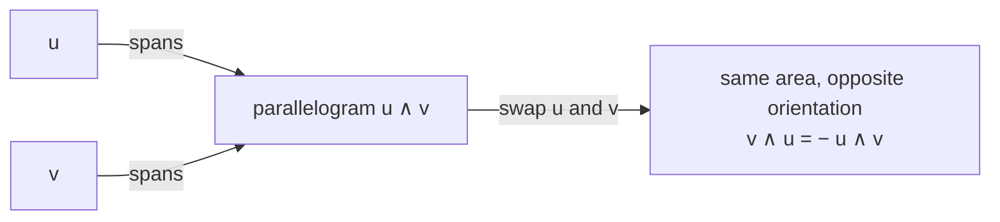

# session-log.md — the Obsidian session log template (`teach/v1`)

Written at the end of every session to `data/tmp/session-log.md`, then copied into the vault:

```bash
learner log --session "$S" --file data/tmp/session-log.md
```

The CLI decides the destination (`$LT_VAULT_DIR/sessions/<date>-<goal>.md`, else
`data/vault/sessions/...`). You never choose the path and you never write into the vault
directly.

**The log is a study artifact, not a transcript.** Someone re-reading it in three weeks should
be able to redo the reasoning without the conversation. Rewrite the steps cleanly; do not paste
the chat.

**No numbers you did not read from the CLI.** Scores, assistance levels and states come from the
`learner record` calls you actually made and from `learner summary`. If you did not record it,
it does not go in the log.

---

## Template

````markdown
---
goal: differential-forms
goal_title: "Differential forms"
session: s_01J8Z9K2QW
date: 2026-09-05
channel: claude-code
prompt_version: teach/v1
rubric_version: teach-back-v1
minutes: 44
nodes_touched: [covectors, wedge-product]
tags: [learning-tutor, session]
---

# Differential forms — 2026-09-05

**Where we started:** covectors (line integrals and dual spaces both known from the probe).
**Where we stopped:** wedge product, mid-node — antisymmetry checkpoint failed twice.

---

## Step 1 — Covectors: a covector eats a vector and returns a number

Strategy: example-first (node was `unknown`, prerequisites `known`).

Concrete first. On $\mathbb{R}^3$, "height above the floor" is a rule that takes an arrow and
returns a number:

$$\alpha(v) = v^3$$

It is linear: $\alpha(av + bw) = a\,\alpha(v) + b\,\alpha(w)$. That linearity is the whole
definition — a covector is a linear map $V \to \mathbb{R}$.

**Self-explanation asked:** why does linearity have to be part of the definition?
**Answer given:** "otherwise the value depends on how you split the vector up" — correct.

**Where the row-vector analogy breaks:** writing a covector as a row of numbers needs a basis.
The covector exists without one; the row does not. Under a change of basis the row transforms
the opposite way to a column.

### Checkpoint 1

Item `i_7f2a`, kind `apply`.

> Given $\alpha(x,y,z) = 2x - z$, what is $\alpha(1, 5, 4)$?

Answer: **B (-2)** — correct, assistance **0**, confidence 5. **Independent pass.**

---

## Step 2 — The wedge product is antisymmetric

Strategy: visual-first (the content is structural — oriented area).



$$u \wedge v = -\, v \wedge u \qquad\Longrightarrow\qquad u \wedge u = 0$$

**Self-explanation asked:** what does $u \wedge u = 0$ mean geometrically?

### Checkpoint 2

Item `i_9c14`, kind `concept`.

> Which is true for any 1-forms $\alpha, \beta$?

Answer: **A** — wrong, confidence 4. Hint ladder ran to level **3** (strategic); second answer
**C**, correct. Recorded: correct 1, assistance **3**. **Assisted pass — not mastery.**

**Misconception opened (`suspected`):** "the wedge product behaves like ordinary
multiplication". Step 1 (reasoning) `held`; step 2 (prediction) `held`; step 3
(counterexample) `dropped` — the counterexample landed and it was restated correctly. Not
confirmed. Retest next session.

---

## Teach-back — covectors

Score **2** (`teach-back-v1`), assistance 0.
Mechanism correct and in their own words; the example was one of mine; no boundary named.

---

## State after this session

From `learner summary --goal differential-forms`:

- **Known:** line integrals, dual spaces, covectors (1 independent pass, teach-back 2)
- **Fragile:** wedge product — 1 assisted pass at assistance 3, no delayed evidence
- **Unknown:** k-forms, exterior derivative, generalized Stokes
- **Misconceptions active:** none (one suspicion dropped this session)

---

## Next time

Open with a delayed retrieval item on covectors, then re-attack the wedge product with an
example-first framing (visual-first did not carry the antisymmetry), then k-forms.
````

---

## Section rules

- **Frontmatter** is fixed: `goal`, `goal_title`, `session`, `date`, `channel`,
  `prompt_version`, `rubric_version`, `minutes`, `nodes_touched`, `tags`. Add keys only if the
  CLI supplied them.
- **One `## Step N` section per reasoning step**, naming the strategy used. LaTeX for maths,
  Mermaid only where the diagram carried information in the session.
- **Each `### Checkpoint`** records: item id, kind, the stem, the answer given, correct or not,
  the **assistance level reached**, confidence if asked, and the one-line verdict
  (independent pass / assisted pass / not a pass).
- **Misconception blocks** name the claim, the outcome of all three steps, and the resulting
  state. Never write "confirmed" for a sequence you did not run.
- **Teach-back** records score, rubric version and the one-line reason.
- **State after this session** is copied from `learner summary --format md` — do not
  paraphrase it into different words, and do not add decimals; the view deliberately shows
  evidence, not probabilities.
- **Next time** is exactly one paragraph: the opening retrieval item, the node to re-attack and
  with which strategy, and the next new node.
